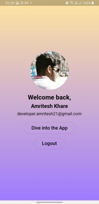
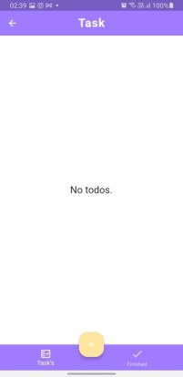

# ToDo App

This is a ToDo App developed using the Flutter framework. The application offers the following functionalities:

## Features

- **Google Signup / Signin**: Users can sign up or sign in using their Google accounts.
- **Firebase Backend**: The app utilizes Firebase as the backend to store and manage user data.
- **Create a ToDo List**: Signed-in users can create a new ToDo list. They can add a task, provide a description for it, select a due date, and submit it. For example:
  - Task Name: Planning the Project
  - Description: I will have to plan employee resource allocation on Trello.
  - Date: 4th April 2023
- **Edit Task**: Users have the ability to edit the task name, description, and due date for any existing task.
- **Delete Task**: Users can delete tasks from their ToDo list.
- **User-Specific Tasks**: Each logged-in user can view and edit only their own tasks, ensuring privacy and segregation.
- **Signout**: Users can sign out from their accounts when they have finished using the app.

## Media

Here are some visual resources to help you better understand the app:

### Screenshots





### Video Demo

[Watch the Video Demo](https://www.example.com)

## Installation

To run the ToDo App on your local machine, follow these steps:

1. Ensure that you have Flutter and Dart installed on your system. For more information, visit the [Flutter installation guide](https://flutter.dev/docs/get-started/install).

2. Clone this repository using the following command:

   ```
   git clone https://github.com/your-username/your-repo.git
   ```

3. Navigate to the project directory:

   ```
   cd your-repo
   ```

4. Fetch the required dependencies by executing the following command:

   ```
   flutter pub get
   ```

5. Connect the app to your Firebase project by following the setup instructions provided by Firebase. Make sure to configure the necessary Firebase authentication and database settings.

6. Build and run the app on your preferred emulator or connected device:

   ```
   flutter run
   ```

## Contributing

Contributions are welcome! If you encounter any issues or have suggestions for improvements, please open an issue or submit a pull request.

## Media Upload

If you would like to contribute images or videos related to the app, please follow these guidelines:

- **Screenshots**: To upload screenshots, place the image files in the `screenshots` directory. Provide a brief description of each screenshot in the "Screenshots" section above, similar to the existing examples.

- **Video Demo**: If you have a video demo of the app, you can upload it to a video hosting platform (e.g., YouTube) and provide the link in the "Video Demo" section above.

## License

This project is licensed under the [MIT License](LICENSE).

## Acknowledgements

We would like to express our gratitude to the following resources and libraries that have contributed to the development of this ToDo App:

- [Flutter](https://flutter.dev/)
- [Firebase](https://firebase.google.com/)
- [Google Sign-In](https://pub.dev/packages/google_sign_in)

Feel free to explore and make use of these resources to further enhance your own projects.

## Contact

For any further information or inquiries, please contact [Your Name](mailto:your-email@example.com).

Happy task managing!